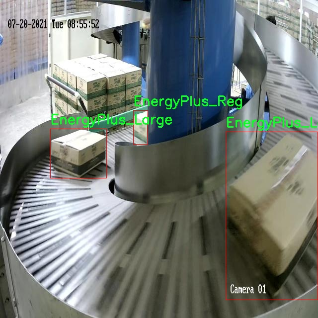

# 改进yolo11-CAA-HSFPN等200+全套创新点大全：流水线能源设备检测系统源码＆数据集全套

### 1.图片效果展示


##### 项目来源 **[人工智能促进会 2024.11.01](https://kdocs.cn/l/cszuIiCKVNis)**

注意：由于项目一直在更新迭代，上面“1.图片效果展示”和“2.视频效果展示”展示的系统图片或者视频可能为老版本，新版本在老版本的基础上升级如下：（实际效果以升级的新版本为准）

  （1）适配了YOLOV11的“目标检测”模型和“实例分割”模型，通过加载相应的权重（.pt）文件即可自适应加载模型。

  （2）支持“图片识别”、“视频识别”、“摄像头实时识别”三种识别模式。

  （3）支持“图片识别”、“视频识别”、“摄像头实时识别”三种识别结果保存导出，解决手动导出（容易卡顿出现爆内存）存在的问题，识别完自动保存结果并导出到tempDir中。

  （4）支持Web前端系统中的标题、背景图等自定义修改。

  另外本项目提供训练的数据集和训练教程,暂不提供权重文件（best.pt）,需要您按照教程进行训练后实现图片演示和Web前端界面演示的效果。

### 2.视频效果展示

[2.1 视频效果展示](https://www.bilibili.com/video/BV1SqSXYwE49/)

### 3.背景

研究背景与意义

随着全球能源需求的不断增长，能源设备的安全性和效率成为了各国政府和企业关注的重点。传统的能源设备检测方法往往依赖人工检查，不仅效率低下，而且容易受到人为因素的影响，导致检测结果的不准确性。为了解决这一问题，基于计算机视觉的自动化检测系统逐渐成为研究的热点。其中，YOLO（You Only Look Once）系列模型因其在实时目标检测中的优越性能而受到广泛关注。YOLOv11作为该系列的最新版本，具有更高的检测精度和更快的处理速度，适合于复杂环境下的目标识别任务。

本研究旨在基于改进的YOLOv11模型，构建一个高效的流水线能源设备检测系统。该系统将利用MV_Train_Data数据集进行训练，该数据集包含1300张图像，专注于能源设备的检测，涵盖了多个类别，包括EnergyPlus_Large、EnergyPlus_Lg和EnergyPlus_Reg。这些类别的多样性为模型的训练提供了丰富的样本，有助于提高模型的泛化能力和鲁棒性。

通过引入改进的YOLOv11模型，我们期望能够显著提升能源设备的检测效率和准确性，从而降低人工检查的成本和风险。该系统的应用不仅能够提高能源设备的安全性，还能为企业节省大量的人力资源，推动能源行业的智能化发展。此外，研究成果将为其他领域的目标检测提供参考，具有重要的学术价值和实际应用意义。通过本项目的实施，我们希望能够为能源设备的智能监测提供新的解决方案，助力实现可持续发展的目标。

### 4.数据集信息展示

##### 4.1 本项目数据集详细数据（类别数＆类别名）

nc: 2
names: ['EnergyPlus_Large', 'EnergyPlus_Reg']


该项目为【目标检测】数据集，请在【训练教程和Web端加载模型教程（第三步）】这一步的时候按照【目标检测】部分的教程来训练

##### 4.2 本项目数据集信息介绍

本项目数据集信息介绍

本项目所使用的数据集名为“MV_Train_Data”，旨在为改进YOLOv11的流水线能源设备检测系统提供支持。该数据集包含了两类主要的能源设备，分别是“EnergyPlus_Large”和“EnergyPlus_Reg”。在数据集的构建过程中，我们注重数据的多样性和代表性，以确保模型在实际应用中的鲁棒性和准确性。

“EnergyPlus_Large”类别主要涵盖了大型能源设备的图像数据，这些设备通常具有复杂的结构和功能，涉及到多种能源的转换和利用。这类设备的检测对于优化能源使用效率、降低运营成本以及提高安全性具有重要意义。另一方面，“EnergyPlus_Reg”类别则聚焦于中小型能源设备，这些设备在日常生活和工业生产中同样扮演着不可或缺的角色。通过对这两类设备的系统性收集与标注，我们力求在不同规模的能源设备检测中实现更高的准确率和召回率。

在数据集的构建过程中，我们采用了多种数据采集手段，包括实地拍摄、图像增强和合成数据生成等，以丰富数据集的内容并提高模型的泛化能力。数据集中的每一张图像都经过精细的标注，确保设备的边界框和类别信息准确无误。此外，数据集还包含了不同环境和光照条件下的图像，以模拟真实场景中的各种挑战。这些努力旨在为YOLOv11模型的训练提供高质量的输入数据，从而提升其在流水线能源设备检测任务中的表现。

总之，“MV_Train_Data”数据集的构建不仅为改进YOLOv11提供了坚实的基础，也为后续的研究和应用奠定了良好的数据基础。通过对该数据集的深入分析与利用，我们期待能够在能源设备检测领域取得突破性进展。




### 5.全套项目环境部署视频教程（零基础手把手教学）

[5.1 所需软件PyCharm和Anaconda安装教程（第一步）](https://www.bilibili.com/video/BV1BoC1YCEKi/?spm_id_from=333.999.0.0&vd_source=bc9aec86d164b67a7004b996143742dc)


[5.2 安装Python虚拟环境创建和依赖库安装视频教程（第二步）](https://www.bilibili.com/video/BV1ZoC1YCEBw?spm_id_from=333.788.videopod.sections&vd_source=bc9aec86d164b67a7004b996143742dc)

### 6.改进YOLOv11训练教程和Web_UI前端加载模型教程（零基础手把手教学）

[6.1 改进YOLOv11训练教程和Web_UI前端加载模型教程（第三步）](https://www.bilibili.com/video/BV1BoC1YCEhR?spm_id_from=333.788.videopod.sections&vd_source=bc9aec86d164b67a7004b996143742dc)


按照上面的训练视频教程链接加载项目提供的数据集，运行train.py即可开始训练



     Epoch   gpu_mem       box       obj       cls    labels  img_size
     1/200     20.8G   0.01576   0.01955  0.007536        22      1280: 100%|██████████| 849/849 [14:42<00:00,  1.04s/it]
               Class     Images     Labels          P          R     mAP@.5 mAP@.5:.95: 100%|██████████| 213/213 [01:14<00:00,  2.87it/s]
                 all       3395      17314      0.994      0.957      0.0957      0.0843

     Epoch   gpu_mem       box       obj       cls    labels  img_size
     2/200     20.8G   0.01578   0.01923  0.007006        22      1280: 100%|██████████| 849/849 [14:44<00:00,  1.04s/it]
               Class     Images     Labels          P          R     mAP@.5 mAP@.5:.95: 100%|██████████| 213/213 [01:12<00:00,  2.95it/s]
                 all       3395      17314      0.996      0.956      0.0957      0.0845

     Epoch   gpu_mem       box       obj       cls    labels  img_size
     3/200     20.8G   0.01561    0.0191  0.006895        27      1280: 100%|██████████| 849/849 [10:56<00:00,  1.29it/s]
               Class     Images     Labels          P          R     mAP@.5 mAP@.5:.95: 100%|███████   | 187/213 [00:52<00:00,  4.04it/s]
                 all       3395      17314      0.996      0.957      0.0957      0.0845


###### [项目数据集下载链接](https://kdocs.cn/l/cszuIiCKVNis)

### 7.原始YOLOv11算法讲解


##### YOLOv11三大损失函数

YOLOv11（You Only Look Once）是一种流行的目标检测算法，其损失函数设计用于同时优化分类和定位任务。YOLO的损失函数通常包括几个部分：
**分类损失、定位损失（边界框回归损失）和置信度损失** 。其中，

  1. box_loss（边界框回归损失）是用于优化预测边界框与真实边界框之间的差异的部分。

  2. cls_loss（分类损失）是用于优化模型对目标类别的预测准确性的部分。分类损失确保模型能够正确地识别出图像中的对象属于哪个类别。

  3. dfl_loss（Distribution Focal Loss）是YOLO系列中的一种损失函数，特别是在一些改进版本如YOLOv5和YOLOv7中被引入。它的主要目的是解决目标检测中的类别不平衡问题，并提高模型在处理小目标和困难样本时的性能。

##### 边界框回归损失详解

box_loss（边界框回归损失）是用于优化预测边界框与真实边界框之间的差异的部分。


##### box_loss 的具体意义


##### 为什么需要 box_loss

  * 精确定位：通过最小化中心点坐标损失和宽高损失，模型能够更准确地预测目标的位置和大小。
  * 平衡不同类型的目标：使用平方根来处理宽高损失，可以更好地平衡不同大小的目标，确保小目标也能得到足够的关注。
  * 稳定训练：适当的损失函数设计有助于模型的稳定训练，避免梯度爆炸或消失等问题。

##### 分类损失详解

在YOLO（You Only Look
Once）目标检测算法中，cls_loss（分类损失）是用于优化模型对目标类别的预测准确性的部分。分类损失确保模型能够正确地识别出图像中的对象属于哪个类别。下面是关于cls_loss的详细解读：

##### 分类损失 (cls_loss) 的具体意义

  
分类损失通常使用交叉熵损失（Cross-Entropy
Loss）来计算。交叉熵损失衡量的是模型预测的概率分布与真实标签之间的差异。在YOLO中，分类损失的具体形式如下：


##### 为什么需要 cls_loss

  * 类别识别：cls_loss 确保模型能够正确识别出图像中的目标属于哪个类别。这对于目标检测任务至关重要，因为不仅需要知道目标的位置，还需要知道目标的类型。

  * 多类别支持：通过最小化分类损失，模型可以处理多个类别的目标检测任务。例如，在道路缺陷检测中，可能需要识别裂缝、坑洞、路面破损等多种类型的缺陷。

  * 提高准确性：分类损失有助于提高模型的分类准确性，从而提升整体检测性能。通过优化分类损失，模型可以更好地学习不同类别之间的特征差异。

##### 分布损失详解

`dfl_loss`（Distribution Focal
Loss）是YOLO系列中的一种损失函数，特别是在一些改进版本如YOLOv5和YOLOv7中被引入。它的主要目的是解决目标检测中的类别不平衡问题，并提高模型在处理小目标和困难样本时的性能。下面是对`dfl_loss`的详细解读：

##### DFL Loss 的背景

在目标检测任务中，类别不平衡是一个常见的问题。某些类别的样本数量可能远远多于其他类别，这会导致模型在训练过程中对常见类别的学习效果较好，而对罕见类别的学习效果较差。此外，小目标和困难样本的检测也是一个挑战，因为这些目标通常具有较少的特征信息，容易被忽略或误分类。

为了应对这些问题，研究者们提出了多种改进方法，其中之一就是`dfl_loss`。`dfl_loss`通过引入分布焦点损失来增强模型对困难样本的关注，并改善类别不平衡问题。

##### DFL Loss 的定义

DFL Loss
通常与传统的交叉熵损失结合使用，以增强模型对困难样本的学习能力。其核心思想是通过对每个类别的预测概率进行加权，使得模型更加关注那些难以正确分类的样本。

DFL Loss 的公式可以表示为：


##### DFL Loss 的具体意义**

  * **类别不平衡：** 通过引入平衡因子 α，DFL Loss 可以更好地处理类别不平衡问题。对于少数类别的样本，可以通过增加其权重来提升其重要性，从而提高模型对这些类别的检测性能。
  *  **困难样本：** 通过聚焦参数 γ，DFL Loss 可以让模型更加关注那些难以正确分类的样本。当 
  * γ 较大时，模型会对那些预测概率较低的样本给予更多的关注，从而提高这些样本的分类准确性。
  *  **提高整体性能** ：DFL Loss 结合了传统交叉熵损失的优势，并通过加权机制增强了模型对困难样本的学习能力，从而提高了整体的检测性能。


### 8.200+种全套改进YOLOV11创新点原理讲解

#### 8.1 200+种全套改进YOLOV11创新点原理讲解大全

由于篇幅限制，每个创新点的具体原理讲解就不全部展开，具体见下列网址中的改进模块对应项目的技术原理博客网址【Blog】（创新点均为模块化搭建，原理适配YOLOv5~YOLOv11等各种版本）

[改进模块技术原理博客【Blog】网址链接](https://gitee.com/qunmasj/good)


#### 8.2 精选部分改进YOLOV11创新点原理讲解

###### 这里节选部分改进创新点展开原理讲解(完整的改进原理见上图和[改进模块技术原理博客链接](https://gitee.com/qunmasj/good)【如果此小节的图加载失败可以通过CSDN或者Github搜索该博客的标题访问原始博客，原始博客图片显示正常】


借鉴了其他算法的这些设计思想

借鉴了VGG的思想，使用了较多的3×3卷积，在每一次池化操作后，将通道数翻倍；

借鉴了network in network的思想，使用全局平均池化（global average pooling）做预测，并把1×1的卷积核置于3×3的卷积核之间，用来压缩特征；（我没找到这一步体现在哪里）

使用了批归一化层稳定模型训练，加速收敛，并且起到正则化作用。

    以上三点为Darknet19借鉴其他模型的点。Darknet53当然是在继承了Darknet19的这些优点的基础上再新增了下面这些优点的。因此列在了这里

借鉴了ResNet的思想，在网络中大量使用了残差连接，因此网络结构可以设计的很深，并且缓解了训练中梯度消失的问题，使得模型更容易收敛。

使用步长为2的卷积层代替池化层实现降采样。（这一点在经典的Darknet-53上是很明显的，output的长和宽从256降到128，再降低到64，一路降低到8，应该是通过步长为2的卷积层实现的；在YOLOv11的卷积层中也有体现，比如图中我标出的这些位置）

#### 特征融合

模型架构图如下

  Darknet-53的特点可以这样概括：（Conv卷积模块+Residual Block残差块）串行叠加4次

  Conv卷积层+Residual Block残差网络就被称为一个stage


上面红色指出的那个，原始的Darknet-53里面有一层 卷积，在YOLOv11里面，把一层卷积移除了

为什么移除呢？

        原始Darknet-53模型中间加的这个卷积层做了什么？滤波器（卷积核）的个数从 上一个卷积层的512个，先增加到1024个卷积核，然后下一层卷积的卷积核的个数又降低到512个

        移除掉这一层以后，少了1024个卷积核，就可以少做1024次卷积运算，同时也少了1024个3×3的卷积核的参数，也就是少了9×1024个参数需要拟合。这样可以大大减少了模型的参数，（相当于做了轻量化吧）

        移除掉这个卷积层，可能是因为作者发现移除掉这个卷积层以后，模型的score有所提升，所以才移除掉的。为什么移除掉以后，分数有所提高呢？可能是因为多了这些参数就容易，参数过多导致模型在训练集删过拟合，但是在测试集上表现很差，最终模型的分数比较低。你移除掉这个卷积层以后，参数减少了，过拟合现象不那么严重了，泛化能力增强了。当然这个是，拿着你做实验的结论，反过来再找补，再去强行解释这种现象的合理性。

过拟合


通过MMdetection官方绘制册这个图我们可以看到，进来的这张图片经过一个“Feature Pyramid Network(简称FPN)”，然后最后的P3、P4、P5传递给下一层的Neck和Head去做识别任务。 PAN（Path Aggregation Network）


“FPN是自顶向下，将高层的强语义特征传递下来。PAN就是在FPN的后面添加一个自底向上的金字塔，对FPN补充，将低层的强定位特征传递上去，

FPN是自顶（小尺寸，卷积次数多得到的结果，语义信息丰富）向下（大尺寸，卷积次数少得到的结果），将高层的强语义特征传递下来，对整个金字塔进行增强，不过只增强了语义信息，对定位信息没有传递。PAN就是针对这一点，在FPN的后面添加一个自底（卷积次数少，大尺寸）向上（卷积次数多，小尺寸，语义信息丰富）的金字塔，对FPN补充，将低层的强定位特征传递上去，又被称之为“双塔战术”。

FPN层自顶向下传达强语义特征，而特征金字塔则自底向上传达强定位特征，两两联手，从不同的主干层对不同的检测层进行参数聚合,这样的操作确实很皮。
#### 自底向上增强

而 PAN（Path Aggregation Network）是对 FPN 的一种改进，它的设计理念是在 FPN 后面添加一个自底向上的金字塔。PAN 引入了路径聚合的方式，通过将浅层特征图（低分辨率但语义信息较弱）和深层特征图（高分辨率但语义信息丰富）进行聚合，并沿着特定的路径传递特征信息，将低层的强定位特征传递上去。这样的操作能够进一步增强多尺度特征的表达能力，使得 PAN 在目标检测任务中表现更加优秀。


### 可重参化EfficientRepBiPAN优化Neck
#### Repvgg-style
Repvgg-style的卷积层包含
卷积+ReLU结构，该结构能够有效地利用硬件资源。

在训练时，Repvgg-style的卷积层包含
卷积、
卷积、identity。（下图左图）


在推理时，通过重参数化（re-parameterization），上述的多分支结构可以转换为单分支的
卷积。（下图右图）


基于上述思想，作者设计了对GPU硬件友好的EfficientRep Backbone和Rep-PAN Neck，将它们用于YOLOv6中。

EfficientRep Backbone的结构图：


Rep-PAN Neck结构图：


#### Multi-path
只使用repvgg-style不能达到很好的精度-速度平衡，对于大模型，作者探索了多路径的网络结构。

参考该博客提出了Bep unit，其结构如下图所示：


CSP（Cross Stage Partial）-style计算量小，且有丰富的梯度融合信息，广泛应用于YOLO系列中，比如YOLOv11、PPYOLOE。

作者将Bep unit与CSP-style结合，设计了一种新的网络结构BepC3，如下图所示：


基于BepC3模块，作者设计了新的CSPBep Backbone和CSPRepPAN Neck，以达到很好的精度-速度平衡。

其他YOLO系列在使用CSP-stype结构时，partial ratio设置为1/2。为了达到更好的性能，在YOLOv6m中partial ratio的值为2/3，在YOLOv6l中partial ratio的值为1/2。

对于YOLOv6m，单纯使用Rep-style结构和使用BepC3结构的对比如下图所示：

#### BIFPN
BiFPN 全称 Bidirectional Feature Pyramid Network 加权双向（自顶向下 + 自低向上）特征金字塔网络。

相比较于PANet，BiFPN在设计上的改变：

总结下图：
图d 蓝色部分为自顶向下的通路，传递的是高层特征的语义信息；红色部分是自底向上的通路，传递的是低层特征的位置信息；紫色部分是上述第二点提到的同一层在输入节点和输入节点间新加的一条边。


我们删除那些只有一条输入边的节点。这么做的思路很简单：如果一个节点只有一条输入边而没有特征融合，那么它对旨在融合不同特征的特征网络的贡献就会很小。删除它对我们的网络影响不大，同时简化了双向网络；如上图d 的 P7右边第一个节点

如果原始输入节点和输出节点处于同一层，我们会在原始输入节点和输出节点之间添加一条额外的边。思路：以在不增加太多成本的情况下融合更多的特性；

与只有一个自顶向下和一个自底向上路径的PANet不同，我们处理每个双向路径(自顶向下和自底而上)路径作为一个特征网络层，并重复同一层多次，以实现更高层次的特征融合。如下图EfficientNet 的网络结构所示，我们对BiFPN是重复使用多次的。而这个使用次数也不是我们认为设定的，而是作为参数一起加入网络的设计当中，使用NAS技术算出来的。


Weighted Feature Fusion 带权特征融合：学习不同输入特征的重要性，对不同输入特征有区分的融合。
设计思路：传统的特征融合往往只是简单的 feature map 叠加/相加 (sum them up)，比如使用concat或者shortcut连接，而不对同时加进来的 feature map 进行区分。然而，不同的输入 feature map 具有不同的分辨率，它们对融合输入 feature map 的贡献也是不同的，因此简单的对他们进行相加或叠加处理并不是最佳的操作。所以这里我们提出了一种简单而高效的加权特融合的机制。
常见的带权特征融合有三种方法，分别是：


​
  这种方法比较简单，直接加一个可学习的权重。但是由于这个权重不受限制，所有可能引起训练的不稳定，所有并不推荐。
Softmax-based fusion: O = ∑ i e w i ∗ I i ϵ + ∑ j e w j O = \sum_{i} \frac{e^{w_i} * I_i}{ \epsilon+\sum_{j}e^{w_j}}O=∑ 

 

​
  使用这种方法可以将范围放缩到 [ 0 , 1 ] [0, 1][0,1] 之间，训练稳定，但是训练很慢，所有也不推荐。
Fast normalized fusion: O = ∑ i w i ∗ I i ϵ + ∑ j w j O = \sum_{i} \frac{w_i * I_i}{ \epsilon+\sum_{j}w_j}O=∑ 


### 9.系统功能展示

图9.1.系统支持检测结果表格显示

  图9.2.系统支持置信度和IOU阈值手动调节

  图9.3.系统支持自定义加载权重文件best.pt(需要你通过步骤5中训练获得)

  图9.4.系统支持摄像头实时识别

  图9.5.系统支持图片识别

  图9.6.系统支持视频识别

  图9.7.系统支持识别结果文件自动保存

  图9.8.系统支持Excel导出检测结果数据


### 10. YOLOv11核心改进源码讲解

#### 10.1 deconv.py

以下是代码中最核心的部分，并附上详细的中文注释：

```python
import math
import torch
from torch import nn
from einops.layers.torch import Rearrange

# 定义一个卷积层的类，支持不同的权重获取方式
class Conv2d_cd(nn.Module):
    def __init__(self, in_channels, out_channels, kernel_size=3, stride=1,
                 padding=1, dilation=1, groups=1, bias=False, theta=1.0):
        super(Conv2d_cd, self).__init__() 
        # 初始化标准卷积层
        self.conv = nn.Conv2d(in_channels, out_channels, kernel_size=kernel_size, stride=stride, padding=padding, dilation=dilation, groups=groups, bias=bias)
        self.theta = theta  # 用于后续权重计算的参数
    
    def get_weight(self):
        # 获取卷积层的权重
        conv_weight = self.conv.weight
        conv_shape = conv_weight.shape
        # 重排权重形状
        conv_weight = Rearrange('c_in c_out k1 k2 -> c_in c_out (k1 k2)')(conv_weight)
        # 创建新的权重张量
        conv_weight_cd = torch.zeros(conv_shape[0], conv_shape[1], 3 * 3, device=conv_weight.device, dtype=conv_weight.dtype)
        # 将原权重赋值到新权重
        conv_weight_cd[:, :, :] = conv_weight[:, :, :]
        # 调整权重
        conv_weight_cd[:, :, 4] = conv_weight[:, :, 4] - conv_weight[:, :, :].sum(2)
        # 重排回原始形状
        conv_weight_cd = Rearrange('c_in c_out (k1 k2) -> c_in c_out k1 k2', k1=conv_shape[2], k2=conv_shape[3])(conv_weight_cd)
        return conv_weight_cd, self.conv.bias  # 返回调整后的权重和偏置


# 定义一个卷积层的类，支持不同的权重获取方式
class Conv2d_ad(nn.Module):
    def __init__(self, in_channels, out_channels, kernel_size=3, stride=1,
                 padding=1, dilation=1, groups=1, bias=False, theta=1.0):
        super(Conv2d_ad, self).__init__() 
        self.conv = nn.Conv2d(in_channels, out_channels, kernel_size=kernel_size, stride=stride, padding=padding, dilation=dilation, groups=groups, bias=bias)
        self.theta = theta
    
    def get_weight(self):
        # 获取卷积层的权重
        conv_weight = self.conv.weight
        conv_shape = conv_weight.shape
        # 重排权重形状
        conv_weight = Rearrange('c_in c_out k1 k2 -> c_in c_out (k1 k2)')(conv_weight)
        # 根据theta调整权重
        conv_weight_ad = conv_weight - self.theta * conv_weight[:, :, [3, 0, 1, 6, 4, 2, 7, 8, 5]]
        # 重排回原始形状
        conv_weight_ad = Rearrange('c_in c_out (k1 k2) -> c_in c_out k1 k2', k1=conv_shape[2], k2=conv_shape[3])(conv_weight_ad)
        return conv_weight_ad, self.conv.bias  # 返回调整后的权重和偏置


# 定义一个卷积层的类，支持不同的权重获取方式
class DEConv(nn.Module):
    def __init__(self, dim):
        super(DEConv, self).__init__()
        # 初始化多个卷积层
        self.conv1_1 = Conv2d_cd(dim, dim, 3, bias=True)
        self.conv1_2 = Conv2d_ad(dim, dim, 3, bias=True)
        self.conv1_5 = nn.Conv2d(dim, dim, 3, padding=1, bias=True)
        
        self.bn = nn.BatchNorm2d(dim)  # 批归一化层
        self.act = nn.ReLU()  # 激活函数（可以根据需要更改）

    def forward(self, x):
        # 前向传播
        w1, b1 = self.conv1_1.get_weight()  # 获取第一个卷积层的权重和偏置
        w2, b2 = self.conv1_2.get_weight()  # 获取第二个卷积层的权重和偏置
        w5, b5 = self.conv1_5.weight, self.conv1_5.bias  # 获取最后一个卷积层的权重和偏置

        # 将所有权重相加
        w = w1 + w2 + w5
        b = b1 + b2 + b5
        # 使用合并后的权重和偏置进行卷积操作
        res = nn.functional.conv2d(input=x, weight=w, bias=b, stride=1, padding=1, groups=1)
        
        # 进行批归一化
        res = self.bn(res)
        
        return self.act(res)  # 返回激活后的结果
    
    def switch_to_deploy(self):
        # 切换到部署模式，合并卷积层的权重和偏置
        w1, b1 = self.conv1_1.get_weight()
        w2, b2 = self.conv1_2.get_weight()
        w5, b5 = self.conv1_5.weight, self.conv1_5.bias

        self.conv1_5.weight = torch.nn.Parameter(w1 + w2 + w5)  # 合并权重
        self.conv1_5.bias = torch.nn.Parameter(b1 + b2 + b5)  # 合并偏置
        
        # 删除不再需要的卷积层
        del self.conv1_1
        del self.conv1_2

if __name__ == '__main__':
    data = torch.randn((1, 128, 64, 64)).cuda()  # 随机生成输入数据
    model = DEConv(128).cuda()  # 初始化模型
    output1 = model(data)  # 前向传播得到输出
    model.switch_to_deploy()  # 切换到部署模式
    output2 = model(data)  # 再次前向传播得到输出
    print(torch.allclose(output1, output2))  # 检查两次输出是否相近
```

### 代码分析
1. **卷积层的定义**：`Conv2d_cd` 和 `Conv2d_ad` 类分别定义了两种不同的卷积操作，提供了获取权重的方法。
2. **权重调整**：在 `get_weight` 方法中，权重根据特定的规则进行调整，适应不同的卷积需求。
3. **DEConv 类**：这个类将多个卷积层组合在一起，并在前向传播中合并它们的权重和偏置。
4. **切换到部署模式**：`switch_to_deploy` 方法用于在模型部署时合并卷积层的权重和偏置，以提高推理效率。

以上是代码的核心部分及其详细注释，帮助理解每个模块的功能和实现逻辑。

这个文件定义了一个名为 `deconv.py` 的 PyTorch 模块，主要用于实现一系列自定义的卷积层和一个包含这些卷积层的反卷积网络（DEConv）。以下是对代码的逐步分析和说明。

首先，导入了一些必要的库，包括 `math`、`torch` 和 `torch.nn`，以及 `einops` 库中的 `Rearrange` 类用于重排张量的维度。此外，还导入了自定义的 `Conv` 模块和 `fuse_conv_and_bn` 函数。

接下来，定义了多个卷积类，分别是 `Conv2d_cd`、`Conv2d_ad`、`Conv2d_rd`、`Conv2d_hd` 和 `Conv2d_vd`。这些类都继承自 `nn.Module`，并实现了不同的卷积操作。

- `Conv2d_cd` 类构造了一个标准的 2D 卷积层，并提供了一个 `get_weight` 方法来获取卷积权重。该方法通过 `Rearrange` 将权重的形状进行重排，并根据特定的规则计算新的权重。

- `Conv2d_ad` 类与 `Conv2d_cd` 类类似，但在 `get_weight` 方法中对权重进行了不同的处理，应用了一个参数 `theta` 来调整权重。

- `Conv2d_rd` 类实现了一个具有条件逻辑的卷积层。在 `forward` 方法中，如果 `theta` 接近于零，则执行标准卷积；否则，计算新的卷积权重并执行卷积操作。

- `Conv2d_hd` 和 `Conv2d_vd` 类是 1D 卷积层的实现，分别提供了各自的 `get_weight` 方法来处理权重。

接下来，定义了 `DEConv` 类，这是一个组合了多个卷积层的网络。它在初始化时创建了多个卷积层实例，并定义了批归一化层和激活函数。在 `forward` 方法中，首先获取每个卷积层的权重和偏置，然后将它们相加以得到最终的卷积权重和偏置，最后执行卷积操作。如果存在批归一化层，则对输出进行归一化处理。

`switch_to_deploy` 方法用于将模型切换到部署模式。在这个方法中，计算所有卷积层的权重和偏置的和，并将它们赋值给最后一个卷积层。之后，删除前面的卷积层，以减少模型的复杂性。

最后，在 `__main__` 部分，创建了一个随机输入数据并实例化 `DEConv` 模型。然后，通过调用 `forward` 方法和 `switch_to_deploy` 方法，比较了两次输出，确保它们相等。

整体来看，这个文件实现了一个灵活的卷积网络，允许通过自定义的卷积层和权重调整来增强模型的表达能力，同时提供了部署时的优化手段。

#### 10.2 SwinTransformer.py

以下是代码中最核心的部分，并附上详细的中文注释：

```python
import torch
import torch.nn as nn
import torch.nn.functional as F
import numpy as np

class Mlp(nn.Module):
    """ 多层感知机（MLP）模块。 """

    def __init__(self, in_features, hidden_features=None, out_features=None, act_layer=nn.GELU, drop=0.):
        super().__init__()
        out_features = out_features or in_features  # 输出特征数默认为输入特征数
        hidden_features = hidden_features or in_features  # 隐藏层特征数默认为输入特征数
        self.fc1 = nn.Linear(in_features, hidden_features)  # 第一层全连接
        self.act = act_layer()  # 激活函数
        self.fc2 = nn.Linear(hidden_features, out_features)  # 第二层全连接
        self.drop = nn.Dropout(drop)  # Dropout层

    def forward(self, x):
        """ 前向传播函数。 """
        x = self.fc1(x)  # 通过第一层
        x = self.act(x)  # 激活
        x = self.drop(x)  # Dropout
        x = self.fc2(x)  # 通过第二层
        x = self.drop(x)  # Dropout
        return x

class WindowAttention(nn.Module):
    """ 基于窗口的多头自注意力模块。 """

    def __init__(self, dim, window_size, num_heads, qkv_bias=True, attn_drop=0., proj_drop=0.):
        super().__init__()
        self.dim = dim  # 输入通道数
        self.window_size = window_size  # 窗口大小
        self.num_heads = num_heads  # 注意力头数
        head_dim = dim // num_heads  # 每个头的维度
        self.scale = head_dim ** -0.5  # 缩放因子

        # 定义相对位置偏置参数表
        self.relative_position_bias_table = nn.Parameter(
            torch.zeros((2 * window_size[0] - 1) * (2 * window_size[1] - 1), num_heads))

        # 计算相对位置索引
        coords_h = torch.arange(self.window_size[0])
        coords_w = torch.arange(self.window_size[1])
        coords = torch.stack(torch.meshgrid([coords_h, coords_w]))  # 生成坐标网格
        coords_flatten = torch.flatten(coords, 1)  # 展平坐标
        relative_coords = coords_flatten[:, :, None] - coords_flatten[:, None, :]  # 计算相对坐标
        relative_coords = relative_coords.permute(1, 2, 0).contiguous()  # 重新排列维度
        relative_coords[:, :, 0] += self.window_size[0] - 1  # 位置偏移
        relative_coords[:, :, 1] += self.window_size[1] - 1
        relative_coords[:, :, 0] *= 2 * self.window_size[1] - 1
        relative_position_index = relative_coords.sum(-1)  # 计算相对位置索引
        self.register_buffer("relative_position_index", relative_position_index)  # 注册为缓冲区

        self.qkv = nn.Linear(dim, dim * 3, bias=qkv_bias)  # QKV线性变换
        self.attn_drop = nn.Dropout(attn_drop)  # 注意力的Dropout
        self.proj = nn.Linear(dim, dim)  # 输出线性变换
        self.proj_drop = nn.Dropout(proj_drop)  # 输出的Dropout
        self.softmax = nn.Softmax(dim=-1)  # Softmax层

    def forward(self, x, mask=None):
        """ 前向传播函数。 """
        B_, N, C = x.shape  # 获取输入的形状
        qkv = self.qkv(x).reshape(B_, N, 3, self.num_heads, C // self.num_heads).permute(2, 0, 3, 1, 4)  # 计算QKV
        q, k, v = qkv[0], qkv[1], qkv[2]  # 分离Q、K、V

        q = q * self.scale  # 缩放Q
        attn = (q @ k.transpose(-2, -1))  # 计算注意力分数

        # 添加相对位置偏置
        relative_position_bias = self.relative_position_bias_table[self.relative_position_index.view(-1)].view(
            self.window_size[0] * self.window_size[1], self.window_size[0] * self.window_size[1], -1)
        relative_position_bias = relative_position_bias.permute(2, 0, 1).contiguous()  # 重新排列维度
        attn = attn + relative_position_bias.unsqueeze(0)  # 加入相对位置偏置

        if mask is not None:
            attn = attn + mask.unsqueeze(1).unsqueeze(0)  # 加入mask
        attn = self.softmax(attn)  # Softmax归一化
        attn = self.attn_drop(attn)  # Dropout

        x = (attn @ v).transpose(1, 2).reshape(B_, N, C)  # 计算输出
        x = self.proj(x)  # 线性变换
        x = self.proj_drop(x)  # Dropout
        return x

class SwinTransformer(nn.Module):
    """ Swin Transformer主干网络。 """

    def __init__(self, patch_size=4, in_chans=3, embed_dim=96, depths=[2, 2, 6, 2], num_heads=[3, 6, 12, 24]):
        super().__init__()
        self.patch_embed = PatchEmbed(patch_size=patch_size, in_chans=in_chans, embed_dim=embed_dim)  # 图像分块嵌入
        self.layers = nn.ModuleList()  # 存储各层

        # 构建每一层
        for i_layer in range(len(depths)):
            layer = BasicLayer(
                dim=int(embed_dim * 2 ** i_layer),
                depth=depths[i_layer],
                num_heads=num_heads[i_layer])
            self.layers.append(layer)

    def forward(self, x):
        """ 前向传播函数。 """
        x = self.patch_embed(x)  # 进行图像分块嵌入
        for layer in self.layers:
            x = layer(x)  # 通过每一层
        return x  # 返回最终输出

def SwinTransformer_Tiny(weights=''):
    """ 创建一个小型的Swin Transformer模型。 """
    model = SwinTransformer(depths=[2, 2, 6, 2], num_heads=[3, 6, 12, 24])  # 初始化模型
    if weights:
        model.load_state_dict(torch.load(weights)['model'])  # 加载权重
    return model
```

### 代码核心部分说明：
1. **Mlp类**：实现了一个简单的多层感知机，包括两层全连接层和激活函数，支持Dropout。
2. **WindowAttention类**：实现了窗口注意力机制，计算Q、K、V，并添加相对位置偏置。
3. **SwinTransformer类**：构建了Swin Transformer的主干网络，包含图像分块嵌入和多个基本层。
4. **SwinTransformer_Tiny函数**：创建一个小型的Swin Transformer模型，并可选择加载预训练权重。

这些核心部分共同构成了Swin Transformer的基本结构和功能。

这个程序文件实现了Swin Transformer模型，主要用于计算机视觉任务。Swin Transformer是一种分层的视觉Transformer架构，使用了移动窗口机制来处理图像数据。代码的结构分为多个类和函数，每个部分都有其特定的功能。

首先，程序导入了必要的库，包括PyTorch和一些用于模型构建的模块。接着定义了一个多层感知机（Mlp）类，包含两个全连接层和一个激活函数，常用于特征转换。

接下来，定义了两个函数`window_partition`和`window_reverse`，它们分别用于将输入特征图分割成窗口和将窗口合并回特征图。这是Swin Transformer的核心思想之一，通过局部窗口来计算自注意力，从而降低计算复杂度。

然后，定义了`WindowAttention`类，这是窗口基础的多头自注意力模块。它支持相对位置偏置，并实现了窗口内的自注意力计算。该模块通过查询、键、值的线性变换来计算注意力权重，并应用相对位置偏置来增强模型的表达能力。

接着，`SwinTransformerBlock`类实现了Swin Transformer的基本块，包含了窗口注意力和前馈网络（FFN）。它还实现了循环移位功能，以便在不同的块之间共享信息。

`PatchMerging`类用于将特征图的补丁合并，减少特征图的分辨率，并增加通道数。`BasicLayer`类则是Swin Transformer的一个基本层，包含多个Swin Transformer块，并在层之间实现了下采样。

`PatchEmbed`类负责将输入图像分割成补丁并进行嵌入，输出为一个适合后续处理的特征张量。

最后，`SwinTransformer`类整合了上述所有组件，构建了完整的Swin Transformer模型。它包含了对输入图像的补丁嵌入、位置编码、多个基本层的处理，以及最终的输出。

此外，程序还定义了一个`update_weight`函数，用于加载预训练模型的权重，并提供了一个`SwinTransformer_Tiny`函数，用于实例化一个小型的Swin Transformer模型。

总体来说，这个程序实现了Swin Transformer的核心结构和功能，适用于图像分类、目标检测等视觉任务。

#### 10.3 cfpt.py

以下是代码中最核心的部分，并附上详细的中文注释：

```python
import torch
import torch.nn as nn
import torch.nn.functional as F
from timm.layers import to_2tuple, trunc_normal_

class CrossLayerPosEmbedding3D(nn.Module):
    def __init__(self, num_heads=4, window_size=(5, 3, 1), spatial=True):
        super(CrossLayerPosEmbedding3D, self).__init__()
        self.spatial = spatial  # 是否使用空间位置嵌入
        self.num_heads = num_heads  # 注意力头的数量
        self.layer_num = len(window_size)  # 层数
        # 初始化相对位置偏置表
        self.relative_position_bias_table = nn.Parameter(
            torch.zeros((2 * window_size[0] - 1) * (2 * window_size[0] - 1), num_heads)
        )
        # 计算相对位置索引
        self._init_relative_position_index(window_size)

        # 初始化绝对位置偏置
        self.absolute_position_bias = nn.Parameter(torch.zeros(len(window_size), num_heads, 1, 1, 1))
        trunc_normal_(self.relative_position_bias_table, std=.02)  # 初始化相对位置偏置表

    def _init_relative_position_index(self, window_size):
        # 计算相对位置索引
        coords_h = [torch.arange(ws) - ws // 2 for ws in window_size]
        coords_w = [torch.arange(ws) - ws // 2 for ws in window_size]
        coords = [torch.stack(torch.meshgrid([coord_h, coord_w])) for coord_h, coord_w in zip(coords_h, coords_w)]
        coords_flatten = torch.cat([torch.flatten(coord, 1) for coord in coords], dim=-1)
        relative_coords = coords_flatten[:, :, None] - coords_flatten[:, None, :]
        relative_coords = relative_coords.permute(1, 2, 0).contiguous()
        relative_coords[:, :, 0] += window_size[0] - 1
        relative_coords[:, :, 1] += window_size[0] - 1
        relative_coords[:, :, 0] *= 2 * window_size[0] - 1
        self.relative_position_index = relative_coords.sum(-1)  # 计算相对位置索引

    def forward(self):
        # 计算位置嵌入
        pos_indicies = self.relative_position_index.view(-1)
        pos_indicies_floor = torch.floor(pos_indicies).long()
        pos_indicies_ceil = torch.ceil(pos_indicies).long()
        value_floor = self.relative_position_bias_table[pos_indicies_floor]
        value_ceil = self.relative_position_bias_table[pos_indicies_ceil]
        weights_ceil = pos_indicies - pos_indicies_floor.float()
        weights_floor = 1.0 - weights_ceil

        pos_embed = weights_floor.unsqueeze(-1) * value_floor + weights_ceil.unsqueeze(-1) * value_ceil
        pos_embed = pos_embed.reshape(1, 1, self.num_token, -1, self.num_heads).permute(0, 4, 1, 2, 3)

        pos_embed = pos_embed.split(self.num_token_per_level, 3)
        layer_embed = self.absolute_position_bias.split([1 for _ in range(self.layer_num)], 0)
        pos_embed = torch.cat([i + j for (i, j) in zip(pos_embed, layer_embed)], dim=-2)
        return pos_embed  # 返回位置嵌入

class CrossLayerSpatialAttention(nn.Module):
    def __init__(self, in_dim, layer_num=3, beta=1, num_heads=4, mlp_ratio=2, reduction=4):
        super(CrossLayerSpatialAttention, self).__init__()
        self.num_heads = num_heads  # 注意力头的数量
        self.reduction = reduction  # 维度缩减比例
        self.window_sizes = [(2 ** i + beta) if i != 0 else (2 ** i + beta - 1) for i in range(layer_num)][::-1]
        self.token_num_per_layer = [i ** 2 for i in self.window_sizes]  # 每层的token数量
        self.token_num = sum(self.token_num_per_layer)  # 总token数量

        # 初始化卷积位置编码、层归一化、QKV卷积、MLP等模块
        self.cpe = nn.ModuleList(
            nn.ModuleList([ConvPosEnc(dim=in_dim, k=3), ConvPosEnc(dim=in_dim, k=3)]) for _ in range(layer_num)
        )
        self.norm1 = nn.ModuleList(LayerNormProxy(in_dim) for _ in range(layer_num))
        self.norm2 = nn.ModuleList(nn.LayerNorm(in_dim) for _ in range(layer_num))
        self.qkv = nn.ModuleList(
            nn.Conv2d(in_dim, self.hidden_dim * 3, kernel_size=1, stride=1, padding=0) for _ in range(layer_num)
        )
        self.mlp = nn.ModuleList(Mlp(in_features=in_dim, hidden_features=int(in_dim * mlp_ratio)) for _ in range(layer_num))
        self.softmax = nn.Softmax(dim=-1)  # Softmax层
        self.proj = nn.ModuleList(nn.Conv2d(self.hidden_dim, in_dim, kernel_size=1, stride=1, padding=0) for _ in range(layer_num))
        self.pos_embed = CrossLayerPosEmbedding3D(num_heads=num_heads, window_size=self.window_sizes, spatial=True)

    def forward(self, x_list):
        # 前向传播
        shortcut_list = []
        q_list, k_list, v_list = [], [], []

        for i, x in enumerate(x_list):
            B, C, H, W = x.shape
            x = self.cpe[i][0](x)  # 位置编码
            shortcut_list.append(x)  # 保存shortcut
            qkv = self.qkv[i](x)  # 计算QKV
            # 进行窗口分割
            qkv_windows = overlaped_window_partition(qkv, self.window_sizes[i], stride=self.stride_list[i], pad=self.padding_list[i])
            q_windows, k_windows, v_windows = qkv_windows[0], qkv_windows[1], qkv_windows[2]
            q_list.append(q_windows)
            k_list.append(k_windows)
            v_list.append(v_windows)

        # 计算注意力
        q_stack = torch.cat(q_list, dim=-2)
        k_stack = torch.cat(k_list, dim=-2)
        v_stack = torch.cat(v_list, dim=-2)
        attn = F.normalize(q_stack, dim=-1) @ F.normalize(k_stack, dim=-1).transpose(-1, -2)
        attn = attn + self.pos_embed()  # 加上位置嵌入
        attn = self.softmax(attn)  # 归一化

        # 计算输出
        out = attn.to(v_stack.dtype) @ v_stack
        out_split = out.split(self.token_num_per_layer, dim=-2)
        out_list = []
        for i, out_i in enumerate(out_split):
            out_i = overlaped_window_reverse(out_i, self.shape_list[i][0], self.shape_list[i][1], self.window_sizes[i], self.stride_list[i], self.padding_list[i])
            out_i = shortcut_list[i] + self.norm1[i](self.proj[i](out_i))  # 残差连接
            out_i = self.cpe[i][1](out_i)  # 位置编码
            out_i = out_i + self.mlp[i](self.norm2[i](out_i))  # MLP层
            out_list.append(out_i)
        return out_list  # 返回每层的输出
```

### 代码核心部分解释：
1. **CrossLayerPosEmbedding3D**: 这个类负责计算位置嵌入，包括相对位置和绝对位置的偏置。它使用了窗口大小和注意力头的数量来初始化相对位置偏置表，并在前向传播中计算位置嵌入。

2. **CrossLayerSpatialAttention**: 这个类实现了跨层空间注意力机制。它通过卷积层计算Q、K、V，并使用窗口分割和重组的方法来计算注意力。注意力结果通过残差连接和MLP层进行处理，最终返回每层的输出。

### 注意事项：
- 代码中使用了多个辅助函数和类（如`ConvPosEnc`、`Mlp`、`overlaped_window_partition`等），这些函数和类的实现是为了支持主要的注意力机制和位置编码的计算。
- 该实现涉及深度学习中的注意力机制，适用于图像处理和计算机视觉任务。

这个程序文件 `cfpt.py` 实现了一个深度学习模型中的交叉层注意力机制，主要用于处理图像数据。文件中定义了多个类和函数，以下是对其主要内容的说明。

首先，文件导入了一些必要的库，包括 PyTorch、数学运算库、Einops（用于张量重排）以及一些神经网络模块。然后，定义了两个主要的注意力机制类：`CrossLayerChannelAttention` 和 `CrossLayerSpatialAttention`，它们分别实现了通道注意力和空间注意力。

在这两个类中，`LayerNormProxy` 类被用作一个层归一化的代理，确保输入数据在不同维度上的归一化处理。`CrossLayerPosEmbedding3D` 类用于生成三维位置嵌入，支持空间和通道两种模式，帮助模型捕捉输入数据的位置信息。

`ConvPosEnc` 类实现了卷积位置编码，使用卷积层对输入进行处理并添加激活函数。`DWConv` 类则实现了深度可分离卷积，用于对输入特征进行卷积操作。

`Mlp` 类定义了一个多层感知机结构，包含两个线性层和一个激活函数。文件中还定义了一些辅助函数，如 `overlaped_window_partition` 和 `overlaped_window_reverse`，用于处理窗口分割和重组操作。

在 `CrossLayerSpatialAttention` 类中，构造函数初始化了多个参数，包括输入维度、层数、头数等。它使用卷积位置编码、层归一化和线性变换来处理输入数据。在前向传播中，输入数据经过多层处理，生成查询、键、值张量，并计算注意力权重，最后通过反向操作恢复原始形状。

`CrossLayerChannelAttention` 类的结构与 `CrossLayerSpatialAttention` 类类似，但在处理过程中侧重于通道维度的注意力机制。它使用了像素反向分层和像素重排等操作，以便在通道维度上进行注意力计算。

总体而言，这个程序文件实现了一个复杂的注意力机制，结合了空间和通道的特征提取，适用于图像处理任务。通过多层的注意力机制和位置编码，模型能够更好地理解输入数据的结构和上下文信息。

#### 10.4 afpn.py

以下是代码中最核心的部分，并添加了详细的中文注释：

```python
import torch
import torch.nn as nn
import torch.nn.functional as F
from ..modules.conv import Conv  # 导入自定义的卷积模块

class BasicBlock(nn.Module):
    """基本块，包含两个卷积层和残差连接"""
    def __init__(self, filter_in, filter_out):
        super(BasicBlock, self).__init__()
        # 第一个卷积层，3x3卷积
        self.conv1 = Conv(filter_in, filter_out, 3)
        # 第二个卷积层，3x3卷积，不使用激活函数
        self.conv2 = Conv(filter_out, filter_out, 3, act=False)

    def forward(self, x):
        residual = x  # 保存输入以便后续的残差连接
        out = self.conv1(x)  # 通过第一个卷积层
        out = self.conv2(out)  # 通过第二个卷积层
        out += residual  # 添加残差
        return self.conv1.act(out)  # 返回经过激活函数处理的输出

class Upsample(nn.Module):
    """上采样模块"""
    def __init__(self, in_channels, out_channels, scale_factor=2):
        super(Upsample, self).__init__()
        # 定义上采样过程，包括1x1卷积和双线性插值上采样
        self.upsample = nn.Sequential(
            Conv(in_channels, out_channels, 1),
            nn.Upsample(scale_factor=scale_factor, mode='bilinear')
        )

    def forward(self, x):
        return self.upsample(x)  # 直接返回上采样后的结果

class Downsample_x2(nn.Module):
    """2倍下采样模块"""
    def __init__(self, in_channels, out_channels):
        super(Downsample_x2, self).__init__()
        # 定义2倍下采样的卷积操作
        self.downsample = Conv(in_channels, out_channels, 2, 2, 0)

    def forward(self, x):
        return self.downsample(x)  # 返回下采样后的结果

class ASFF_2(nn.Module):
    """自适应特征融合模块，处理两个输入特征图"""
    def __init__(self, inter_dim=512):
        super(ASFF_2, self).__init__()
        self.inter_dim = inter_dim
        compress_c = 8  # 压缩通道数

        # 定义权重卷积层
        self.weight_level_1 = Conv(self.inter_dim, compress_c, 1)
        self.weight_level_2 = Conv(self.inter_dim, compress_c, 1)
        self.weight_levels = nn.Conv2d(compress_c * 2, 2, kernel_size=1, stride=1, padding=0)
        self.conv = Conv(self.inter_dim, self.inter_dim, 3)  # 融合后的卷积层

    def forward(self, input1, input2):
        # 计算每个输入的权重
        level_1_weight_v = self.weight_level_1(input1)
        level_2_weight_v = self.weight_level_2(input2)

        # 合并权重并计算最终权重
        levels_weight_v = torch.cat((level_1_weight_v, level_2_weight_v), 1)
        levels_weight = self.weight_levels(levels_weight_v)
        levels_weight = F.softmax(levels_weight, dim=1)  # 归一化权重

        # 融合输入特征图
        fused_out_reduced = input1 * levels_weight[:, 0:1, :, :] + \
                            input2 * levels_weight[:, 1:2, :, :]

        out = self.conv(fused_out_reduced)  # 通过卷积层
        return out  # 返回融合后的输出

class BlockBody_P345(nn.Module):
    """特征块体，处理三个尺度的特征图"""
    def __init__(self, channels=[64, 128, 256, 512]):
        super(BlockBody_P345, self).__init__()

        # 定义不同尺度的卷积块
        self.blocks_scalezero1 = nn.Sequential(Conv(channels[0], channels[0], 1))
        self.blocks_scaleone1 = nn.Sequential(Conv(channels[1], channels[1], 1))
        self.blocks_scaletwo1 = nn.Sequential(Conv(channels[2], channels[2], 1))

        # 定义下采样和上采样模块
        self.downsample_scalezero1_2 = Downsample_x2(channels[0], channels[1])
        self.upsample_scaleone1_2 = Upsample(channels[1], channels[0], scale_factor=2)

        # 定义自适应特征融合模块
        self.asff_scalezero1 = ASFF_2(inter_dim=channels[0])
        self.asff_scaleone1 = ASFF_2(inter_dim=channels[1])

        # 定义多个基本块
        self.blocks_scalezero2 = nn.Sequential(
            BasicBlock(channels[0], channels[0]),
            BasicBlock(channels[0], channels[0]),
            BasicBlock(channels[0], channels[0]),
            BasicBlock(channels[0], channels[0]),
        )
        self.blocks_scaleone2 = nn.Sequential(
            BasicBlock(channels[1], channels[1]),
            BasicBlock(channels[1], channels[1]),
            BasicBlock(channels[1], channels[1]),
            BasicBlock(channels[1], channels[1]),
        )

    def forward(self, x):
        x0, x1, x2 = x  # 分别获取三个尺度的输入特征图

        # 通过卷积块处理输入特征图
        x0 = self.blocks_scalezero1(x0)
        x1 = self.blocks_scaleone1(x1)
        x2 = self.blocks_scaletwo1(x2)

        # 进行特征融合
        scalezero = self.asff_scalezero1(x0, self.upsample_scaleone1_2(x1))
        scaleone = self.asff_scaleone1(self.downsample_scalezero1_2(x0), x1)

        # 继续处理融合后的特征图
        x0 = self.blocks_scalezero2(scalezero)
        x1 = self.blocks_scaleone2(scaleone)

        return x0, x1, x2  # 返回处理后的特征图
```

### 代码核心部分说明：
1. **BasicBlock**：实现了一个基本的卷积块，包含两个卷积层和残差连接。
2. **Upsample/Downsample**：实现了上采样和下采样的功能，使用卷积和插值方法。
3. **ASFF_2**：自适应特征融合模块，能够融合两个输入特征图，并计算其权重。
4. **BlockBody_P345**：特征块体，负责处理多个尺度的特征图，使用卷积块和自适应特征融合模块进行特征提取和融合。

这些模块构成了一个特征提取和融合的网络结构，适用于多尺度特征处理的任务。

这个程序文件 `afpn.py` 实现了一个基于深度学习的特征金字塔网络（FPN），主要用于目标检测和图像分割等计算机视觉任务。文件中定义了多个类，每个类都代表了网络中的不同模块和结构。

首先，文件导入了一些必要的库，包括 `torch` 和 `torch.nn`，以及一些自定义的卷积和块模块。接着，定义了一个 `BasicBlock` 类，它是一个基本的残差块，包含两个卷积层和一个残差连接。这个块在深度学习中常用于构建更深的网络，以缓解梯度消失的问题。

接下来，定义了一些上采样和下采样的模块，例如 `Upsample`、`Downsample_x2`、`Downsample_x4` 和 `Downsample_x8`，这些模块用于调整特征图的尺寸，以便在不同的尺度上进行特征融合。

`ASFF_2`、`ASFF_3` 和 `ASFF_4` 类实现了自适应特征融合模块（ASFF），它们通过计算输入特征图的权重来融合不同尺度的特征。这些模块使用了软最大化（softmax）来计算权重，并将加权后的特征图进行融合，最后通过卷积层进行处理。

`BlockBody_P345` 和 `BlockBody_P2345` 类分别实现了特征金字塔的不同层次结构。它们包含多个卷积块和自适应特征融合模块，构成了网络的主体。`BlockBody_P345_Custom` 和 `BlockBody_P2345_Custom` 类允许用户自定义块的类型，提供了更大的灵活性。

`AFPN_P345` 和 `AFPN_P2345` 类是特征金字塔网络的具体实现，它们初始化了输入和输出通道，并构建了网络的整体结构。在前向传播中，这些类接收多个尺度的特征图，经过一系列的卷积和融合操作，输出融合后的特征图。

最后，`AFPN_P345_Custom` 和 `AFPN_P2345_Custom` 类提供了自定义的特征金字塔网络实现，允许用户选择不同的块类型，以适应不同的任务需求。

整体而言，这个程序文件展示了如何构建一个复杂的特征金字塔网络，通过模块化的设计，方便了网络的扩展和自定义，适用于多种计算机视觉任务。

注意：由于此博客编辑较早，上面“10.YOLOv11核心改进源码讲解”中部分代码可能会优化升级，仅供参考学习，以“11.完整训练+Web前端界面+200+种全套创新点源码、数据集获取”的内容为准。

### 11.完整训练+Web前端界面+200+种全套创新点源码、数据集获取


# [下载链接：https://mbd.pub/o/bread/Zp6ak5Zs](https://mbd.pub/o/bread/Zp6ak5Zs)